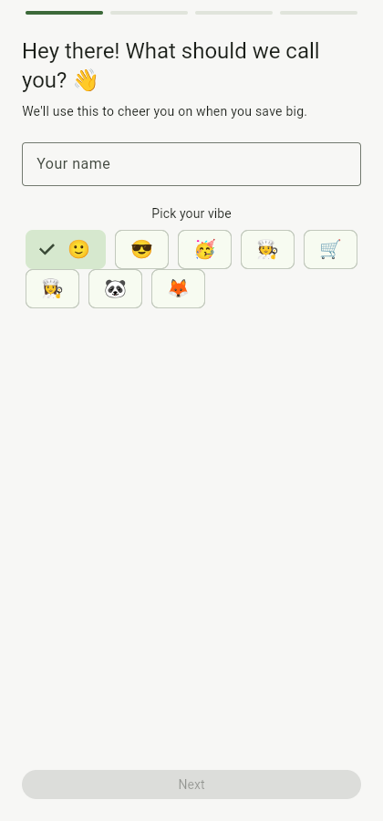
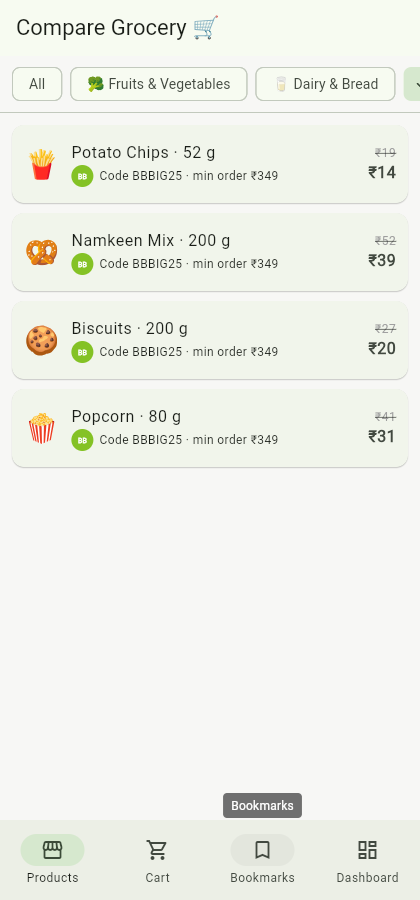
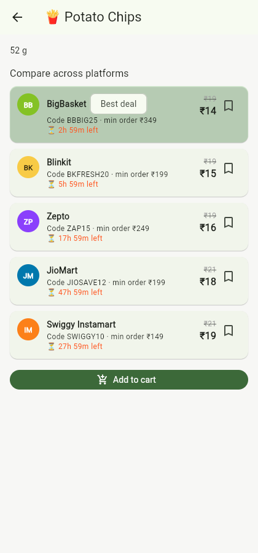
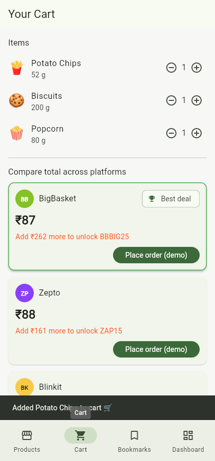
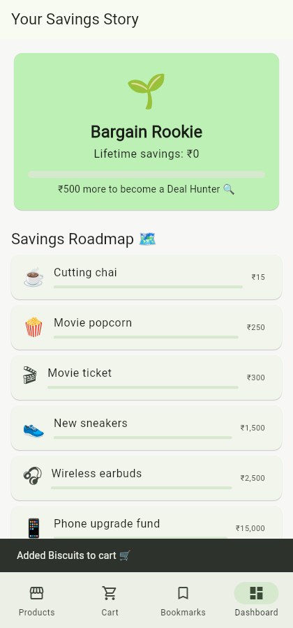
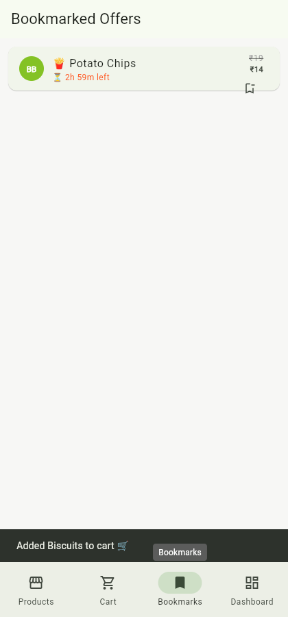

# Compare Grocery 🛒

A Flutter app that compares grocery prices, coupons, and payment offers
across quick-commerce platforms — so you always know which app has the
best deal before you order.

There's no live pricing API for Blinkit/Zepto/Instamart/BigBasket/JioMart
(none of them expose one publicly), so the app runs on a realistic,
deterministic mock catalog behind a repository layer. Swapping in a real
pricing backend later just means replacing `CatalogRepository`.

## Features

- **Onboarding** — name/avatar, location, preferred grocery category, and
  preferred payment method. Persisted locally, so it only runs once.
- **Product list** — pre-filtered to your preferred category, with prices
  shown coupon-applied plus the minimum basket value needed to unlock it.
- **Product detail** — every platform's price for that product side by
  side: base price, coupon code, min basket value, a live countdown to
  the coupon's expiry, and a bookmark toggle.
- **Cart & cross-platform comparison** — add items from any product page;
  the cart screen totals your whole basket on *every* platform, applying
  each platform's coupon (once you meet its minimum basket value) and
  your preferred payment method's offer, then highlights the cheapest one.
- **Bookmarks** — saved price offers with live expiry countdowns, store
  badges, and a quick-link back to the product.
- **Dashboard** — a "Savings Master" badge that levels up with your
  lifetime savings (Bargain Rookie 🌱 → Deal Hunter 🔍 → Discount Ninja 🥷
  → Savings Master 🏆 → Frugal Legend 👑), a savings roadmap showing fun
  things you could buy with what you've saved (☕ chai → ✈️ a weekend
  trip), and your order history.

Platform "logos" are stylized colored initials (BK, ZP, IM, BB, JM) rather
than the real trademarked logos.

## Screenshots

| Onboarding | Product list | Product detail |
|---|---|---|
|  |  |  |

| Cart comparison | Dashboard | Bookmarks |
|---|---|---|
|  |  |  |

## Tech stack

- **Flutter** (Material 3)
- **flutter_bloc** / **Cubit** for state management, **hydrated_bloc** for
  automatic on-device persistence of profile, cart, bookmarks, and savings
  history — no login server, no database.
- **go_router** for navigation (onboarding redirect, bottom-nav shell,
  product detail deep link).
- **intl** for currency formatting.

## Project structure

```
lib/
  data/
    models/         Plain data classes (Product, Coupon, PaymentOffer, ...)
    mock/           Static mock catalog (products, platforms, coupons, ...)
    repositories/   CatalogRepository — the one seam to swap in a real API
  domain/           Pure business logic: CartComparator, savings tiers, roadmap
  blocs/            ProfileBloc, CartBloc, BookmarkBloc, SavingsBloc, CategoryFilterCubit
  presentation/
    screens/        One folder per screen, with screen-local widgets alongside
    widgets/        Shared widgets (platform badge, countdown timer, ...)
  core/             Theme, currency formatting, router
  app.dart          Providers + MaterialApp.router wiring
  main.dart         Entry point, HydratedBloc storage init
test/               Unit tests for CartComparator, savings tiers, catalog data
```

## Setup

1. **Install the Flutter SDK** (stable channel) — see
   [docs.flutter.dev/get-started/install](https://docs.flutter.dev/get-started/install)
   if you don't have it yet. Verify with:
   ```bash
   flutter doctor
   ```
2. **Install dependencies**:
   ```bash
   flutter pub get
   ```
3. **Run it**:
   ```bash
   flutter run -d chrome   # web — no extra setup needed
   flutter run             # or on a connected Android/iOS device/emulator,
                            # once you've installed the Android SDK / Xcode
   ```

> **Windows note:** if your Windows username contains a space, newer
> versions of `path_provider_android`/`path_provider_foundation` can fail
> to build (a native-assets build-hook bug with spaced paths). This repo's
> `pubspec.yaml` pins older versions via `dependency_overrides` to avoid
> it. If you hit a similar error, try removing the override and updating
> those two packages once the upstream bug is fixed.

## How to use it

1. On first launch, complete onboarding: pick a name/avatar, enter a
   location, pick your usual grocery category, and pick a payment method.
2. Browse the product list (already filtered to your category — tap
   **All** or another chip to change it) and tap any product to see its
   price on every platform.
3. Tap **Add to cart** on a product's detail page — the cart isn't tied
   to a specific platform, just products and quantities.
4. Open the **Cart** tab to see your basket's total on every platform,
   with coupons and payment offers applied where you qualify. Tap
   **Place order (demo)** on whichever platform you'd pick — this is a
   simulated checkout (no real payment), and it records your savings.
5. Bookmark a platform's offer from a product detail page (🔖 icon) and
   find it later in the **Bookmarks** tab, countdown and all.
6. Check the **Dashboard** tab to watch your Savings Master badge and
   roadmap grow as you place more (demo) orders.

## Testing

```bash
flutter analyze   # static analysis
flutter test      # unit tests: cart-total math, coupon/payment-offer
                   # gating, savings tiers, catalog data consistency
```

## Known limitations

- All prices, coupons, and payment offers are mock data, regenerated
  deterministically at app start (coupon expiry countdowns reset relative
  to launch time — there's no backend to persist a "real" expiry).
- No Android/iOS build has been verified in this environment (only Chrome
  web) — install Android Studio / Xcode if you want to test on a device
  or emulator.
