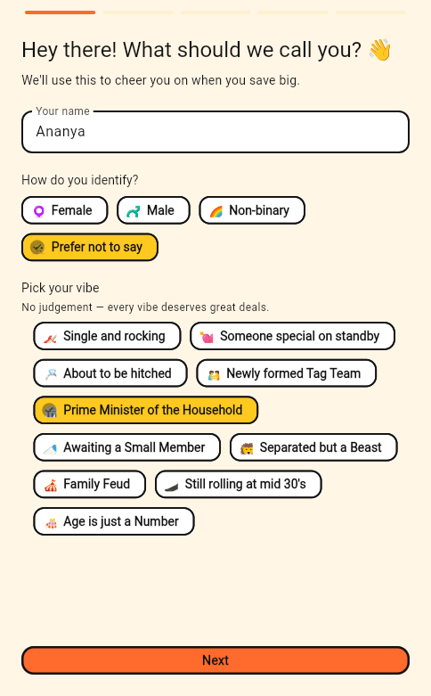
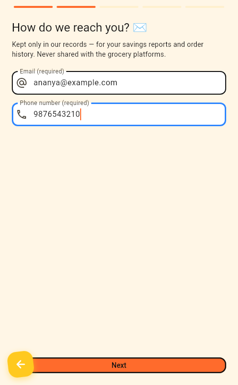
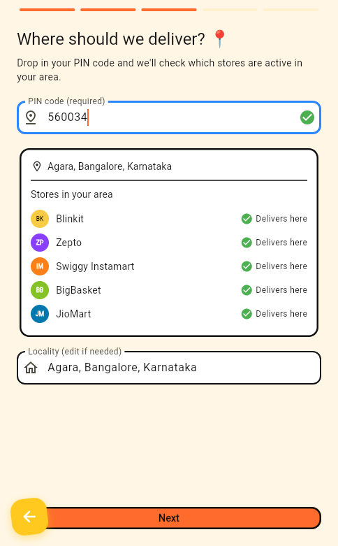
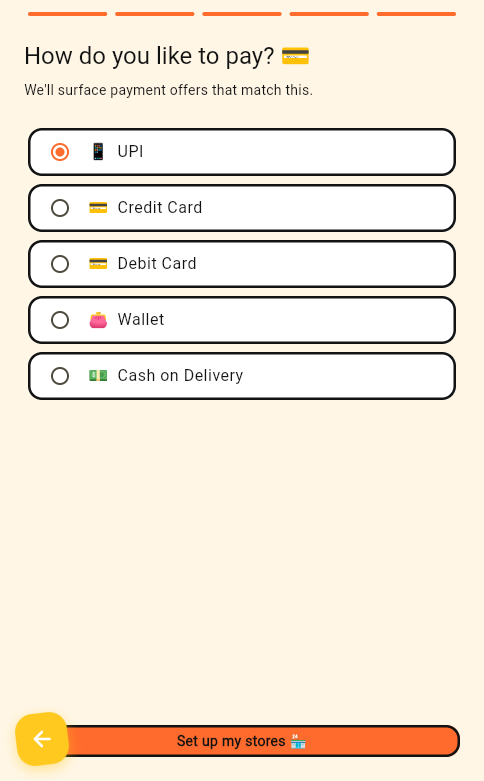
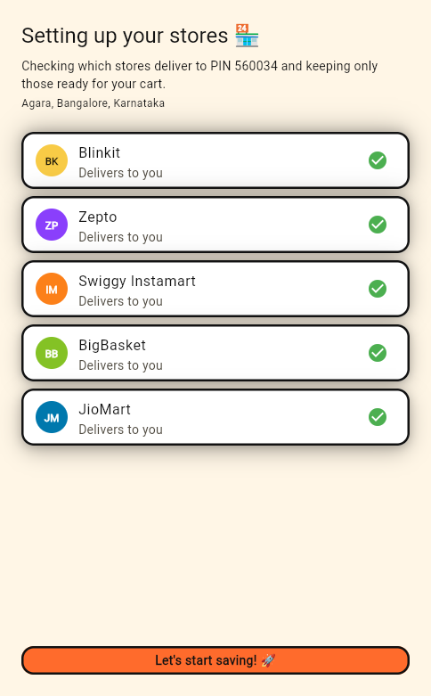
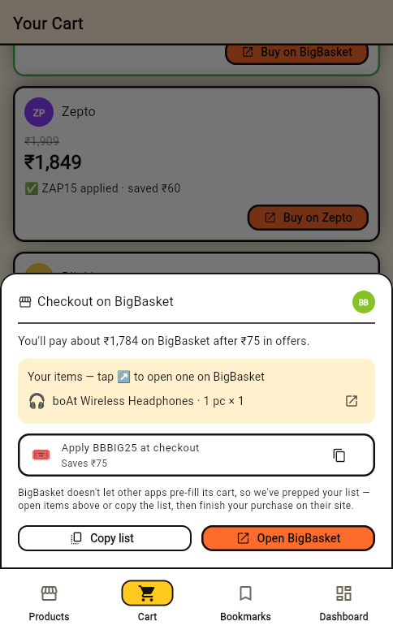

# Compare Grocery 🛒

A Flutter app that compares grocery prices, coupons, and payment offers
across quick-commerce platforms — so you always know which store has the
best deal before you order, and finish the purchase on that store's own
website.

The five simulated platforms are **Blinkit, Zepto, Swiggy Instamart,
BigBasket, and JioMart**. Their "logos" are stylized colored initials
(BK, ZP, IM, BB, JM), not the real trademarked artwork.

## ⚠️ What to expect (read this first)

This is a **fully self-contained demo**. It looks and behaves like a real
price-comparison app, but:

- **All prices, coupons, and payment offers are mock data.** None of the
  five platforms expose a public pricing API, so the app runs on a
  realistic, deterministic mock catalog (90+ branded products across 23
  categories) behind a repository layer. Swapping in a real backend later
  means replacing one class: `CatalogRepository`.
- **PIN-code serviceability is real (via India Post), store coverage is
  curated.** Your PIN code is validated live against the free India Post
  API and resolved to a locality; which stores "deliver" there comes from
  a curated metro map (with an offline postal-prefix fallback), because
  the platforms expose no public serviceability API.
- **Checkout hands you off to the real store.** There is no partner API
  to pre-fill a third-party cart, so the app preps your shopping list and
  coupon code, then opens the chosen platform's own website to finish the
  purchase — in an in-app browser tab on Android/iOS (where hidden store
  sessions are kept warm), or your external browser elsewhere. No payment
  ever happens inside this app.
- **Everything is stored on-device.** Profile (including the email/phone
  collected for record keeping), cart, bookmarks, and order history
  persist locally via `hydrated_bloc`. Nothing is sent to the grocery
  platforms.

## Application walkthrough

Every screenshot below is captured automatically from the live app by a
scripted walkthrough (see [Regenerating the screenshots](#regenerating-the-screenshots)).

### 1 · Tell us who you are

Name, sex category, and a quirky **vibe tile** whose emoji becomes your
avatar. Next, email + phone — mandatory, validated with playful error
messages, and kept **only for the app's own record keeping** (never sent
to the grocery platforms).

| Profile & vibe | Contact details |
|---|---|
|  |  |

### 2 · Drop your PIN code — watch the live check

Type a 6-digit PIN and the app validates it against the **India Post
API**, resolves your locality (here `560034` → Agara, Bangalore), and
shows exactly which of the five stores deliver to you. Pick your usual
category and payment method, and the store-setup screen keeps **only the
serviceable stores** ready — on Android/iOS it opens a hidden browser
session for each one.

| Live PIN serviceability | Payment preference | Store setup |
|---|---|---|
|  |  |  |

### 3 · Shop the catalog, scoped to your area

The dashboard is home base: start shopping, see your local stores, and
track savings. The catalog shows 23 categories of branded products, and
**every price you see is hunted only across the stores that deliver to
your PIN** — the product page lines up each store's price, coupon code,
min-basket gate, and a live expiry countdown, with bookmarks one tap away.

| Dashboard | Product list | Product detail |
|---|---|---|
|  |  |  |

### 4 · Compare the whole basket, then buy on the real store

The cart totals your basket on every serviceable store — coupons and
payment offers applied where you qualify, cheapest first, best deal
framed in green. **Buy on …** opens the handoff sheet: expected total,
your items with search deep links, the coupon code ready to copy, then
the store's own website to pay. Confirming *I placed my order* records
your savings; bookmarked offers wait in their own tab with countdowns.

| Cart comparison | Checkout handoff | Bookmarks |
|---|---|---|
|  |  |  |

## Capabilities

| Area | What it does |
|---|---|
| **Onboarding** | Five steps: name + sex category + vibe tile; validated email/phone (record keeping only); PIN code with live serviceability check; favorite category; preferred payment. Runs once; persisted locally. |
| **PIN-code serviceability** | Live India Post validation with locality resolution and an offline postal-prefix fallback. Every price surface in the app is scoped to the stores serving that PIN. |
| **Store setup** | One-time screen that keeps only serviceable stores; on Android/iOS it opens a hidden browser session per store that mirrors your cart as you shop. |
| **Dashboard** | Start-shopping shortcut, local stores, gamified **Savings Master** badge, savings roadmap, active orders, and order history. |
| **Product catalog** | 23 categories, brand-level products (the same product type from multiple brands at different prices), pre-filtered to your favorite category; each card shows the best coupon-applied price and the winning store. |
| **Product detail** | Serviceable stores' prices side by side — base price, coupon code, min basket, live expiry countdown — plus per-offer bookmarks and a quantity stepper. |
| **Cart comparison** | Whole-basket totals per serviceable store with coupons and payment offers applied, cheapest first. Stores that don't deliver show no total and no buy link. |
| **Checkout handoff** | Copyable shopping list + coupon code, per-item search deep links, then the store's own website — a promoted in-app tab on Android/iOS (other stores' hidden tabs auto-close) or the external browser elsewhere. |
| **Order lifecycle** | Confirmed orders sit under "Active orders" until you tap **Mark delivered**, then join order history. |
| **Savings gamification** | Badge tiers (Bargain Rookie 🌱 → Frugal Legend 👑) plus a quirky roadmap of things your savings could buy (☕ chai → ✈️ a weekend trip). |
| **Bright pop design** | Neo-brutalist orange/yellow/blue/green on cream with thick black outlines, and **floating tiles** lit from the screen centre — shadows lean as you scroll, cards lift on hover and press down on tap. |

## Dependencies

Runtime packages (see `pubspec.yaml`):

| Package | Version | Why it's here |
|---|---|---|
| `flutter_bloc` | ^9.1.0 | State management (Bloc/Cubit pattern) |
| `equatable` | ^2.0.5 | Value equality for states and models |
| `hydrated_bloc` | ^10.0.0 | On-device persistence of profile, cart, bookmarks, savings |
| `path_provider` | ^2.1.4 | Storage directory for `hydrated_bloc` on mobile/desktop |
| `go_router` | ^15.1.2 | Navigation: onboarding redirect, bottom-nav shell, deep links |
| `intl` | ^0.20.2 | ₹ currency and date formatting |
| `http` | ^1.2.2 | Live PIN-code lookups against the India Post API |
| `url_launcher` | ^6.3.1 | Opens the chosen store's website (external-browser fallback) |
| `webview_flutter` | ^4.10.0 | Hidden per-store sessions + in-app checkout tab (Android/iOS) |
| `cupertino_icons` | ^1.0.8 | iOS-style icons (Flutter default) |

Dev packages: `flutter_test`, `flutter_lints` ^6.0.0, and
`integration_test`/`flutter_driver` (screenshot walkthrough).

Pinned overrides: `path_provider_android: 2.2.15` and
`path_provider_foundation: 2.4.1` — newer versions can fail to build on
Windows when your username contains a space. Remove once fixed upstream.

Environment: Dart SDK ^3.12.2 (comes with a current stable Flutter).

## Setup

1. **Install the Flutter SDK** (stable channel) — see
   [docs.flutter.dev/get-started/install](https://docs.flutter.dev/get-started/install),
   then verify with `flutter doctor`.
2. **Install dependencies**: `flutter pub get`
3. **Run it**:

   ```bash
   flutter run -d chrome        # web — quickest start, no extra setup
   ```

   **Android emulator** (recommended — the hidden store sessions and
   in-app checkout tab only exist on Android/iOS):

   ```bash
   flutter emulators                    # list configured emulators
   flutter emulators --launch Pixel_7   # boot one (or use Android Studio)
   flutter devices                      # wait until emulator-5554 appears
   flutter run -d emulator-5554         # first Gradle build takes a while
   ```

## Testing

```bash
flutter analyze   # static analysis — should report no issues
flutter test      # unit tests: cart math, coupon/payment gating,
                  # savings tiers, PIN serviceability, catalog data
```

### Regenerating the screenshots

The images in this README are produced by a scripted end-to-end
walkthrough (`integration_test/walkthrough_test.dart`) that onboards a
user, checks a PIN, shops, and opens checkout — capturing each stage to
`docs/screenshots/`. To rerun it, start a
[chromedriver](https://googlechromelabs.github.io/chrome-for-testing/)
matching your Chrome on port 4444, then:

```bash
flutter drive --driver=test_driver/integration_test.dart \
  --target=integration_test/walkthrough_test.dart \
  -d chrome --browser-dimension 430,932
```

## Project structure

```
lib/
  data/
    models/         Plain data classes (Product, Coupon, UserProfile, ...)
    mock/           Static mock catalog (products, platforms, coupons, ...)
    repositories/   CatalogRepository — the one seam to swap in a real API
    services/       PincodeService (India Post), PlatformSessionManager
                    (hidden per-store browser sessions)
  domain/           Pure business logic: CartComparator, BestOffer,
                    location availability, savings tiers, roadmap items
  blocs/            ProfileBloc, CartBloc, BookmarkBloc, SavingsBloc,
                    CategoryFilterCubit
  presentation/
    helpers/        watchServingPlatforms (location-scoped store list)
    screens/        One folder per screen, with screen-local widgets
    widgets/        Shared widgets (FloatingTile, platform badge, ...)
  core/             Theme, currency formatting, router
  app.dart          Providers + MaterialApp.router wiring
  main.dart         Entry point, HydratedBloc storage init
integration_test/   Scripted walkthrough that captures README screenshots
test/               Unit tests: cart math, savings tiers, serviceability,
                    best offers, catalog consistency
```

## Known limitations

- Mock data is regenerated deterministically at app start, so coupon
  expiry countdowns reset relative to launch time — there's no backend to
  persist a "real" expiry.
- Carts can't be pre-filled on the stores' websites (no partner APIs), so
  checkout preps your list/coupon and hands off; hidden store sessions
  and the in-app checkout tab need Android/iOS (`webview_flutter` has no
  web/desktop support) — other targets fall back to the external browser.
- The India Post API is called from the browser on web builds and can be
  blocked by CORS; the app then shows its offline PIN estimate instead.
